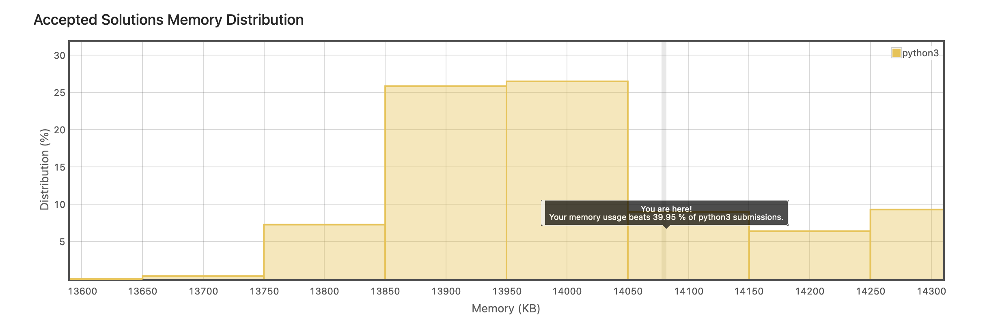

<details>
<summary>Find Numbers with Even Number of Digits</summary>

<br>

## Instructions

<br>

    Given an array nums of integers, return how many of them contain an even number of digits.

    Example 1:

    Input: nums = [12,345,2,6,7896]
    Output: 2
    Explanation:
    12 contains 2 digits (even number of digits).
    345 contains 3 digits (odd number of digits).
    2 contains 1 digit (odd number of digits).
    6 contains 1 digit (odd number of digits).
    7896 contains 4 digits (even number of digits).
    Therefore only 12 and 7896 contain an even number of digits.

    Example 2:

    Input: nums = [555,901,482,1771]
    Output: 1
    Explanation:
    Only 1771 contains an even number of digits.


    Constraints:

        1 <= nums.length <= 500
        1 <= nums[i] <= 105

<br>

<details>
<summary>Solution</summary>

```
lass Solution:
    def findNumbers(self, nums: List[int]) -> int:
        count = 0
        for number in nums:

            length = len(str(number))

            if length % 2 == 0:
                count +=1

        return count
```

</details>

<details>
<summary>Runtime and Space Results</summary>




</details>

</details>

---
