# Easy 100 top interview Questions

<details>
<summary>STRINGS</summary>
<br>
<details>
<summary>Reverse String with O(1) SPACE</summary>

<br>
## Instructions

<br>

    Write a function that reverses a string. The input string is given as an array of characters s.

    You must do this by modifying the input array in-place with O(1) extra memory.


    Example 1:

    Input: s = ["h","e","l","l","o"]
    Output: ["o","l","l","e","h"]

    Example 2:

    Input: s = ["H","a","n","n","a","h"]
    Output: ["h","a","n","n","a","H"]


    Constraints:

        1 <= s.length <= 105
        s[i] is a printable ascii character.

<details>
<summary>Solution</summary>

```
        j = -1
        i = 0
        while(i < (len(s)//2)):
            temp = s[i]
            s[i] = s[j]
            s[j] = temp
            j -=1
            i +=1

```

</details>

<details>
<summary>Runtime and Space Results</summary>

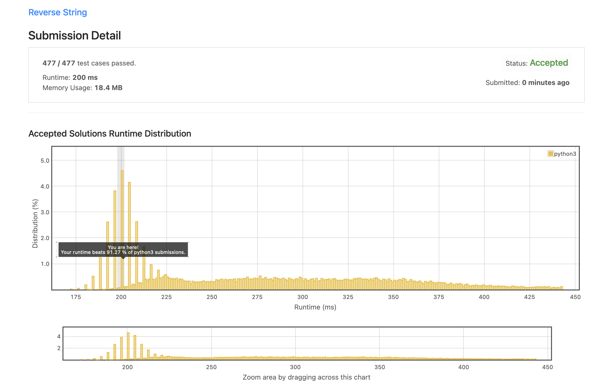
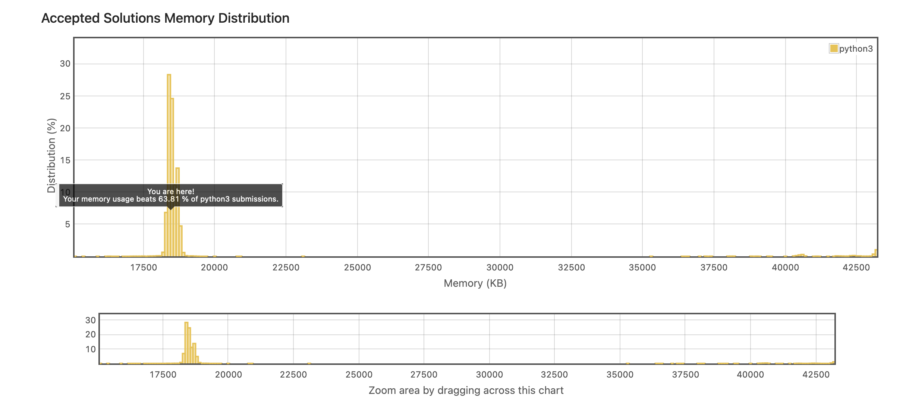

</details>
</details>

---

<details>
<summary>Valid Anagram</summary>

<br>

## Instructions

<br>

    Given two strings s and t, return true if t is an anagram of s, and false otherwise.

    An Anagram is a word or phrase formed by rearranging the letters of a different word or phrase, typically using all the original letters exactly once.


    Example 1:

    Input: s = "anagram", t = "nagaram"
    Output: true

    Example 2:

    Input: s = "rat", t = "car"
    Output: false


    Constraints:

        1 <= s.length, t.length <= 5 * 104
        s and t consist of lowercase English letters.

<details>
<summary>Solution</summary>

```
class Solution:
    def isAnagram(self, s: str, t: str) -> bool:

        freq_dict = {}

        if len(s) != len(t):
            return False

        for x in range(len(s)):
            if s[x] not in freq_dict:
                freq_dict[s[x]] = 1
            else:
                freq_dict[s[x]] += 1

        for j in range(len(t)):
            if t[j] in freq_dict:
                freq_dict[t[j]] -=1


        for key, val in freq_dict.items():
            if val != 0:
                return False

        return True
```

</details>

<details>
<summary>Space/Time Results</summary>

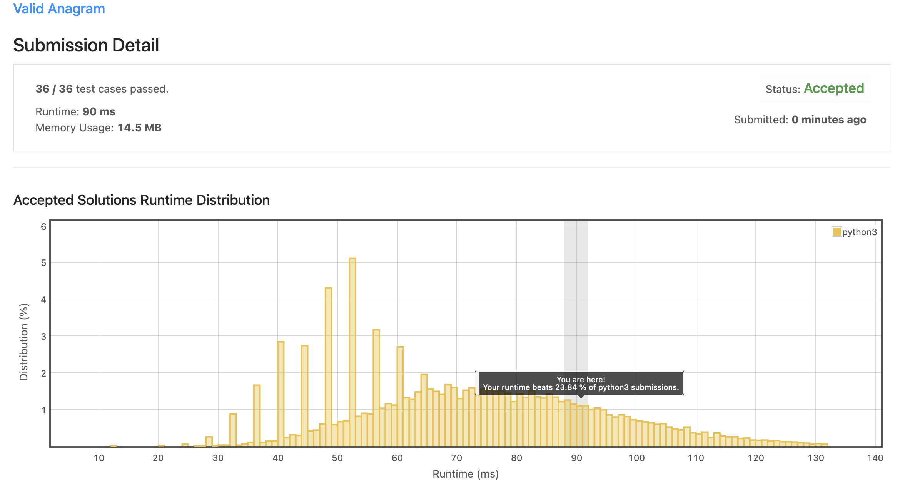
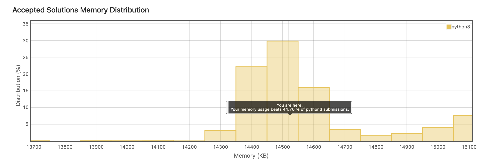

</details>
</details>

---

<details>
<summary>Reverse Integer</summary>

<br>

<br>

## Instructions

<br>

    Given a signed 32-bit integer x, return x with its digits reversed. If reversing x causes the value to go outside the signed 32-bit integer range [-2^31, 2^31 - 1], then return 0.

    Assume the environment does not allow you to store 64-bit integers (signed or unsigned).

    Example 1:

    Input: x = 123
    Output: 321

    Example 2:

    Input: x = -123
    Output: -321

    Example 3:

    Input: x = 120
    Output: 21

    Constraints:

        -2^31 <= x <= 2^31 - 1

<details>
<summary>Solution</summary>

```
class Solution:
    def reverse(self, x: int) -> int:
        j = math.pow(2, 31)

        if x < 0:
            negative_convert = abs(x)
            number = str(negative_convert)
            reversed_string = number[::-1]
            reversed_int = (int(reversed_string))
            if reversed_int > j:
                return 0
            return -abs(reversed_int)

        number = str(x)
        reversed_string = number[::-1]
        reversed_int = (int(reversed_string))
        if reversed_int > j:
                return 0
        return reversed_int

```

</details>

<details>
<summary>Space/Time Results</summary>

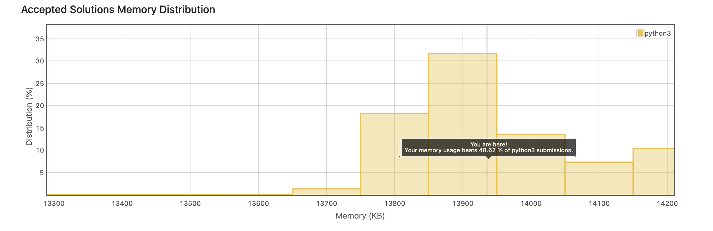
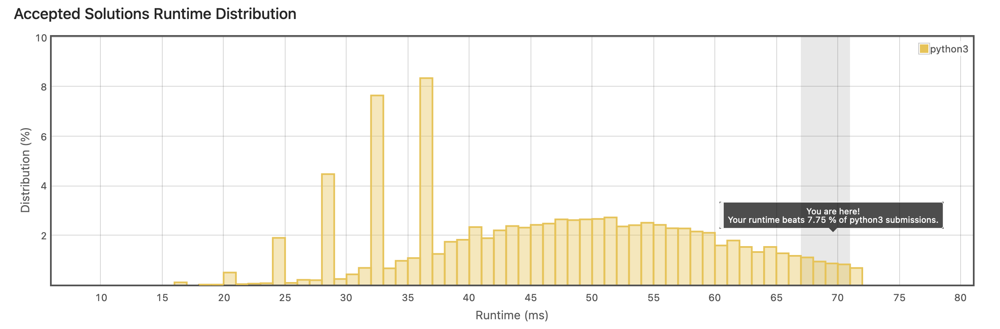

</details>

</details>

---

<details>
<summary>View First Unique Character in a String</summary>

<br>

<br>

## Instructions

<br>

    Given a string s, find the first non-repeating character in it and return its index. If it does not exist, return -1.

    Example 1:

    Input: s = "leetcode"
    Output: 0

    Example 2:

    Input: s = "loveleetcode"
    Output: 2

    Example 3:

    Input: s = "aabb"
    Output: -1

    Constraints:

        1 <= s.length <= 105
        s consists of only lowercase English letters.

<details>
<summary>Solution</summary>

```
class Solution:
    def firstUniqChar(self, s: str) -> int:

        char_dict = {}

        for x in range(len(s)):

            if s[x] not in char_dict:
                char_dict[s[x]] = 1

            else:
                char_dict[s[x]] +=1
        # print(char_dict)


        for x, y in char_dict.items():
            if y == 1:
                print(x)
                return s.index(x)

        return -1
```

</details>

<details>
<summary>Runtime and Space Results</summary>

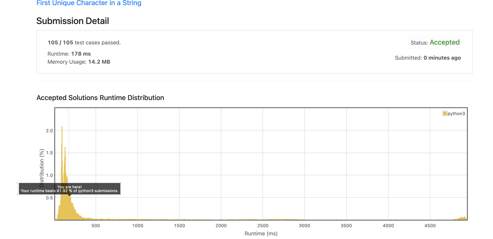
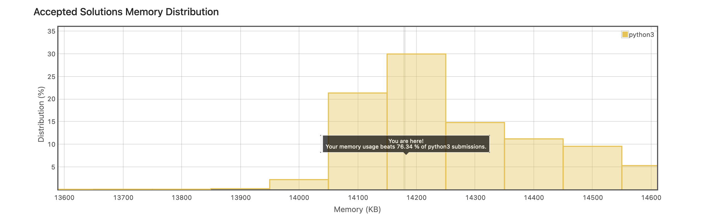

</details>
</details>

---

<details>
<summary>Valid Palidrome</summary>

<br>

## Instructions

<br>

    A phrase is a palindrome if, after converting all uppercase letters into lowercase letters and removing all non-alphanumeric characters, it reads the same forward and backward. Alphanumeric characters include letters and numbers.

    Given a string s, return true if it is a palindrome, or false otherwise.

    Example 1:

    Input: s = "A man, a plan, a canal: Panama"
    Output: true
    Explanation: "amanaplanacanalpanama" is a palindrome.

    Example 2:

    Input: s = "race a car"
    Output: false
    Explanation: "raceacar" is not a palindrome.

    Example 3:

    Input: s = " "
    Output: true
    Explanation: s is an empty string "" after removing non-alphanumeric characters.
    Since an empty string reads the same forward and backward, it is a palindrome.

Constraints:

    1 <= s.length <= 2 * 105
    s consists only of printable ASCII characters.

<details>
<summary>Solution</summary>

```
class Solution:
    def isPalindrome(self, s: str) -> bool:

        only_chars = "".join(x for x in s if x.isalnum()).lower()
        reverse_str = only_chars[::-1]

        if only_chars == reverse_str:
            return True
        return False
```

</details>

<details>
<summary>Runtime and Space Results</summary>

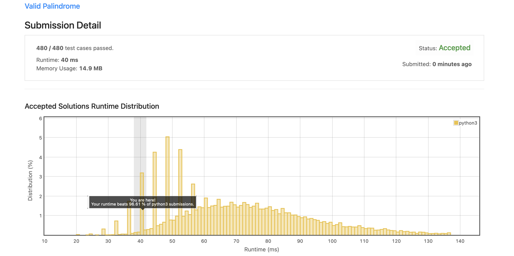
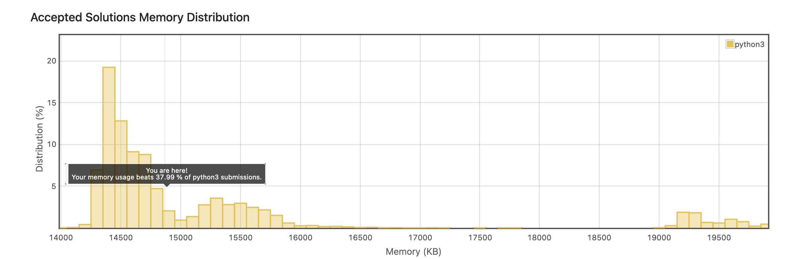

</details>
</details>

<!-- END OF STRINGS -->
</details>

---

<!-- ? <-----------------------ARRAYS---------------------------->

<details>

<summary>ARRAYS</summary>
<br>

<details>
<summary>Remove Duplicates from Sorted Array O(1)</summary>

<br>

## Instructions

<br>

    Given an integer array nums sorted in non-decreasing order, remove the duplicates in-place such that each unique element appears only once. The relative order of the elements should be kept the same.

    Since it is impossible to change the length of the array in some languages, you must instead have the result be placed in the first part of the array nums. More formally, if there are k elements after removing the duplicates, then the first k elements of nums should hold the final result. It does not matter what you leave beyond the first k elements.

    Return k after placing the final result in the first k slots of nums.

    Do not allocate extra space for another array. You must do this by modifying the input array in-place with O(1) extra memory.

    Custom Judge:

    The judge will test your solution with the following code:

    int[] nums = [...]; // Input array
    int[] expectedNums = [...]; // The expected answer with correct length

    int k = removeDuplicates(nums); // Calls your implementation

    assert k == expectedNums.length;
    for (int i = 0; i < k; i++) {
    assert nums[i] == expectedNums[i];
    }

    If all assertions pass, then your solution will be accepted.

    Example 1:

    Input: nums = [1,1,2]
    Output: 2, nums = [1,2,_]
    Explanation: Your function should return k = 2, with the first two elements of nums being 1 and 2 respectively.
    It does not matter what you leave beyond the returned k (hence they are underscores).

    Example 2:

    Input: nums = [0,0,1,1,1,2,2,3,3,4]
    Output: 5, nums = [0,1,2,3,4,_,_,_,_,_]
    Explanation: Your function should return k = 5, with the first five elements of nums being 0, 1, 2, 3, and 4 respectively.
    It does not matter what you leave beyond the returned k (hence they are underscores).

    Constraints:

        1 <= nums.length <= 3 * 104
        -100 <= nums[i] <= 100
        nums is sorted in non-decreasing order.

<br>

<details>
<summary>Solution</summary>

```
class Solution:
    def removeDuplicates(self, nums: List[int]) -> int:


        count_unique = 1
        unique = 0
        current = 1

        if len(nums) == 1:
            return 1

        while (current < len(nums)):

            if nums[current] == nums[unique]:
                nums.pop(current)

            else:
                unique = current
                count_unique += 1
                current = current + 1


        return count_unique
```

</details>

<details>
<summary>Runtime and Space Results</summary>

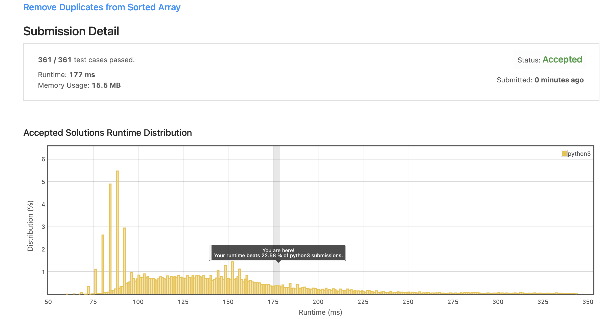
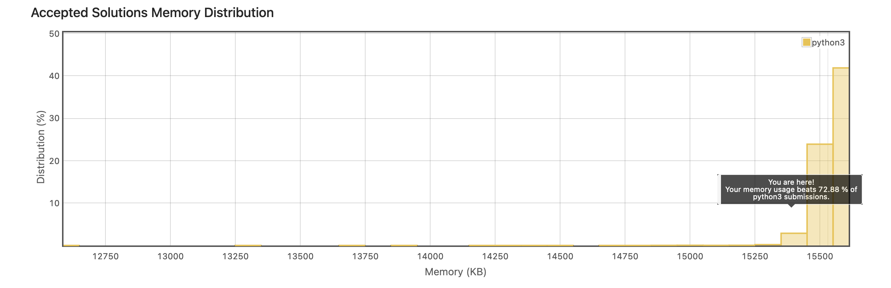

</details>

</details>

---

<details>
<summary>Contains Duplicate</summary>

<br>

## Instructions

<br>

    Given an integer array nums, return true if any value appears at least twice in the array, and return false if every element is distinct.


    Example 1:

    Input: nums = [1,2,3,1]
    Output: true

    Example 2:

    Input: nums = [1,2,3,4]
    Output: false

    Example 3:

    Input: nums = [1,1,1,3,3,4,3,2,4,2]
    Output: true


    Constraints:

        1 <= nums.length <= 105
        -109 <= nums[i] <= 109

<details>
<summary>Solution</summary>

```
class Solution:
    def containsDuplicate(self, nums: List[int]) -> bool:

        remove_dups = set(nums)

        if len(nums) == len(remove_dups):
            return False

        return True
```

</details>

<details>
<summary>Runtime and Space Results</summary>

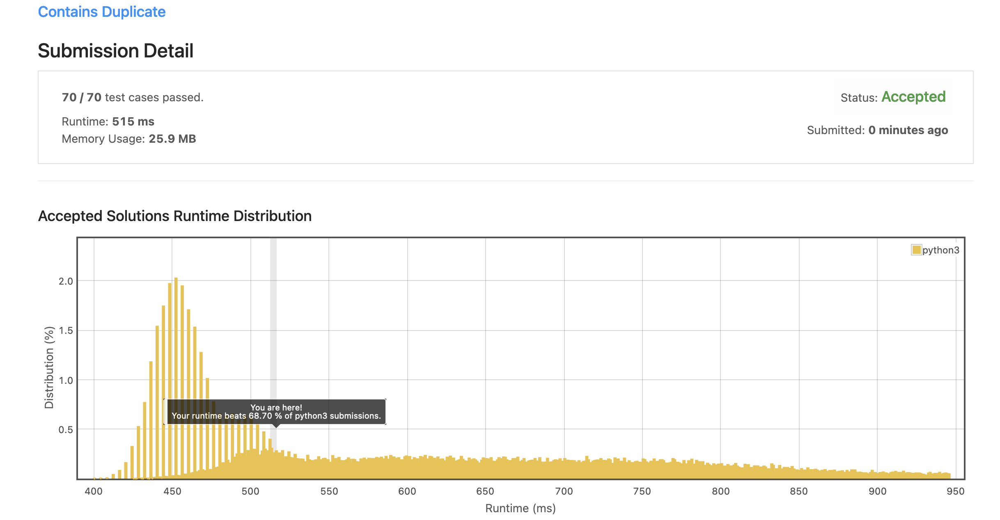
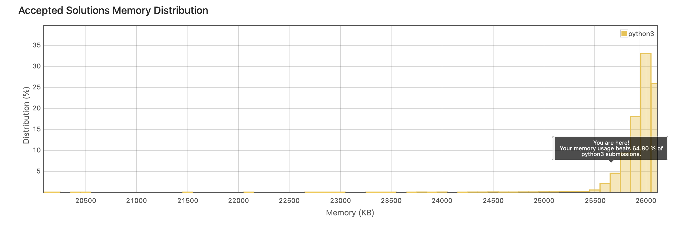

</details>

</details>

---

<details>
<summary>Plus One</summary>

<br>

## Instructions

<br>

    You are given a large integer represented as an integer array digits, where each digits[i] is the ith digit of the integer. The digits are ordered from most significant to least significant in left-to-right order. The large integer does not contain any leading 0's.

    Increment the large integer by one and return the resulting array of digits.


    Example 1:

    Input: digits = [1,2,3]
    Output: [1,2,4]
    Explanation: The array represents the integer 123.
    Incrementing by one gives 123 + 1 = 124.
    Thus, the result should be [1,2,4].

    Example 2:

    Input: digits = [4,3,2,1]
    Output: [4,3,2,2]
    Explanation: The array represents the integer 4321.
    Incrementing by one gives 4321 + 1 = 4322.
    Thus, the result should be [4,3,2,2].

    Example 3:

    Input: digits = [9]
    Output: [1,0]
    Explanation: The array represents the integer 9.
    Incrementing by one gives 9 + 1 = 10.
    Thus, the result should be [1,0].


    Constraints:

        1 <= digits.length <= 100
        0 <= digits[i] <= 9
        digits does not contain any leading 0's.

<br>

<details>
<summary>Solution</summary>

```
class Solution:
    def plusOne(self, digits: List[int]) -> List[int]:

        string = ""
        digit_list = []

        for x in digits:
            string += str(x)

        add_one = int(string) + 1


        for digit in str(add_one):
            digit_list.append(int(digit))

        return digit_list
```

</details>

<details>
<summary>Runtime and Space Results</summary>

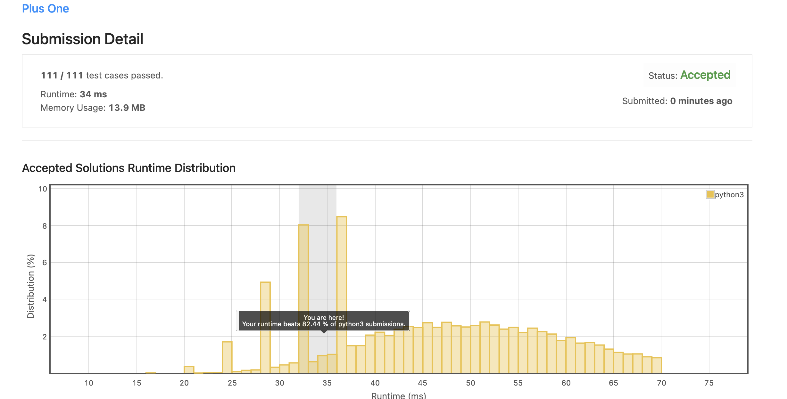
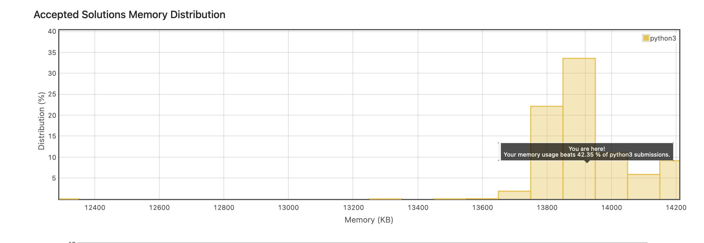

</details>

</details>

<!--! End of Arrays -->
</details>

 <!-- ? <-----------------------LINKED LISTS---------------------------->

---

<details>
<summary>Linked Lists</summary>
<br>

<details>
<summary>Delete Node in Linked List</summary>

<br>

## Instructions

<br>

    Write a function to delete a node in a singly-linked list. You will not be given access to the head of the list, instead you will be given access to the node to be deleted directly.

    It is guaranteed that the node to be deleted is not a tail node in the list.

    Example 1:

    Input: head = [4,5,1,9], node = 5
    Output: [4,1,9]
    Explanation: You are given the second node with value 5, the linked list should become 4 -> 1 -> 9 after calling your function.

    Example 2:
    Input: head = [4,5,1,9], node = 1
    Output: [4,5,9]
    Explanation: You are given the third node with value 1, the linked list should become 4 -> 5 -> 9 after calling your function.

    Constraints:

        The number of the nodes in the given list is in the range [2, 1000].
        -1000 <= Node.val <= 1000
        The value of each node in the list is unique.
        The node to be deleted is in the list and is not a tail node

<br>

<details>
<summary>Solution</summary>

```
# Definition for singly-linked list.
# class ListNode:
#     def __init__(self, x):
#         self.val = x
#         self.next = None

class Solution:
    def deleteNode(self, node):
        """
        :type node: ListNode
        :rtype: void Do not return anything, modify node in-place instead.
        """
        node.val = node.next.val
        node.next = node.next.next

```

</details>

<details>
<summary>Runtime and Space Results</summary>

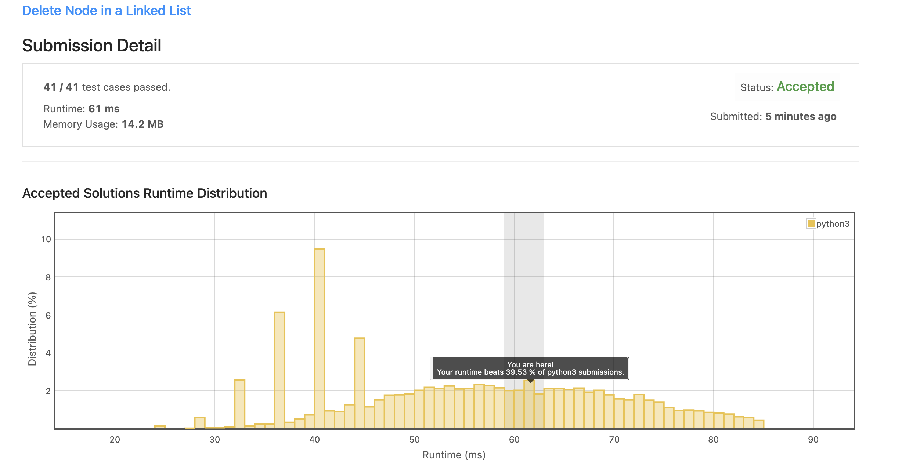
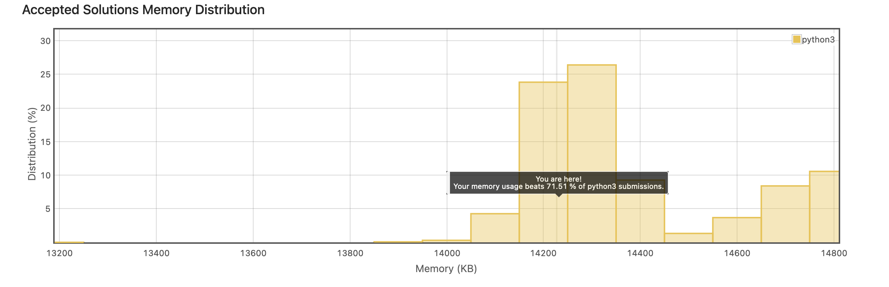

</details>

</details>

---

<details>
<summary>Remove nth node from end on linked list</summary>

<br>

## Instructions

<br>

    Given the head of a linked list, remove the nth node from the end of the list and return its head.

    Example 1:

    Input: head = [1,2,3,4,5], n = 2
    Output: [1,2,3,5]

    Example 2:

    Input: head = [1], n = 1
    Output: []

    Example 3:

    Input: head = [1,2], n = 1
    Output: [1]


    Constraints:

        The number of nodes in the list is sz.
        1 <= sz <= 30
        0 <= Node.val <= 100
        1 <= n <= sz


    Follow up: Could you do this in one pass?

<br>

<details>
<summary>Solution</summary>

        Not the cleanest solution but Im a bit rusty on linked lists, will refactor to better code.

```
class Solution:
    def removeNthFromEnd(self, head: Optional[ListNode], n: int) -> Optional[ListNode]:
        current = head
#       if only one node in linked list
        if current.next == None:
            current.value = None
            return


        current = head
        length = 1

#       get length of linked list
        while(current.next is not None):
            current = current.next
            length = length + 1

      # if the target is == to the head
        current = head
        if length == n:
            current.val = None
            head = current.next

            return head

#       stop at Node previous to target node
        target_node_index = length - n
#       reset current back to head to find target node
        current = head
        count = 1
        while(count != target_node_index):
            count +=1
            current = current.next
        current.next.val = None
        current.next = current.next.next

        return head

```

</details>

<details>
<summary>Runtime and Space Results</summary>

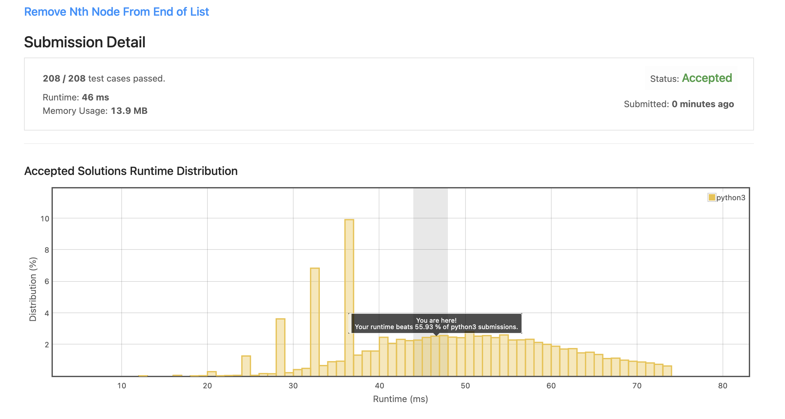
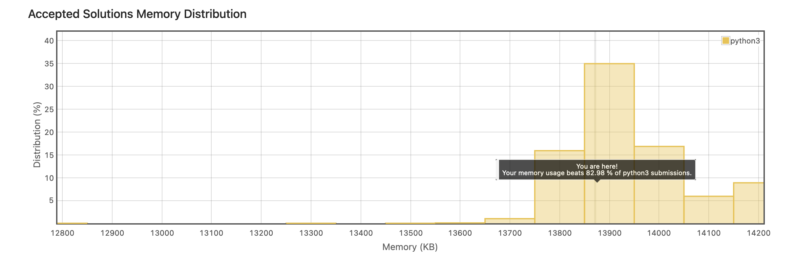

</details>

</details>

---

<details>
<summary>Reverse Linked List</summary>

<br>

## Instructions

<br>

    Given the head of a singly linked list, reverse the list, and return the reversed list.


    Example 1:

    Input: head = [1,2,3,4,5]
    Output: [5,4,3,2,1]

    Example 2:

    Input: head = [1,2]
    Output: [2,1]

    Example 3:

    Input: head = []
    Output: []


    Constraints:

        The number of nodes in the list is the range [0, 5000].
        -5000 <= Node.val <= 5000

<br>

<details>
<summary>Solution</summary>

```
class Solution:
    def reverseList(self, head: Optional[ListNode]) -> Optional[ListNode]:

        prev = None
        current = head
        temp = None

        while(current is not None):
#           stores node after current, so that we can point current node towards prev
            temp = current.next
#           change current pointer to prev node reversing pointer
            current.next = prev
#           move prev, one node to current, and current to temp node
            prev = current
            current = temp

        return prev
```

</details>

<details>
<summary>Runtime and Space Results</summary>

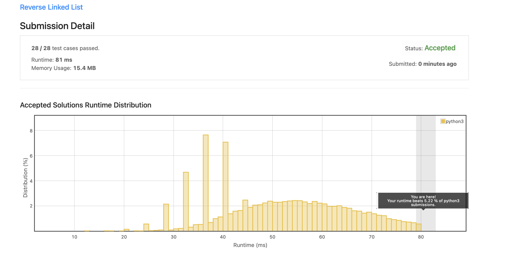
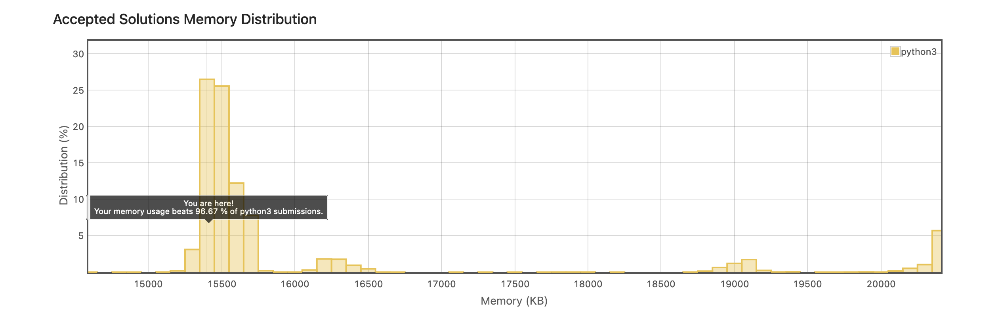

</details>

</details>

---

<!-- !End of LinkedLIST -->
</details>

<!-- TODO TEMPLATE -->

<!-- <details>
<summary>Title</summary>

<br>

## Instructions

<br>

<br>

<details>
<summary>Solution</summary>

```

```

</details>

<details>
<summary>Runtime and Space Results</summary>

![Runtime]
![Space]

</details>

</details>

--- -->
