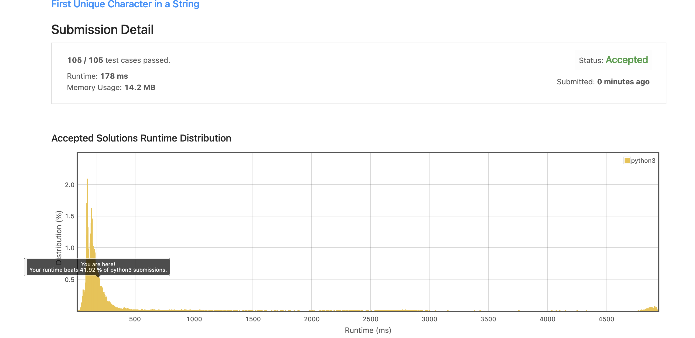
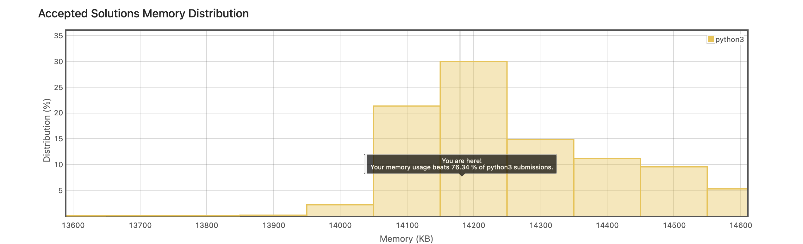
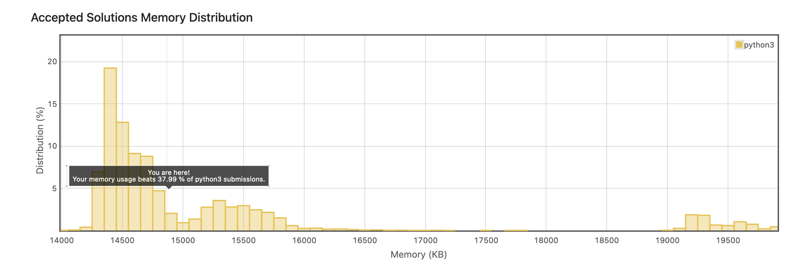

# EASY problems collection from top 100 interview Questions

## Strings

### <span style="color: SandyBrown;">Reverse String with O(1) SPACE</span>

<details>
<summary>View Reverse String</summary>

#### Instructions

    Write a function that reverses a string. The input string is given as an array of characters s.

    You must do this by modifying the input array in-place with O(1) extra memory.


    Example 1:

    Input: s = ["h","e","l","l","o"]
    Output: ["o","l","l","e","h"]

    Example 2:

    Input: s = ["H","a","n","n","a","h"]
    Output: ["h","a","n","n","a","H"]


    Constraints:

        1 <= s.length <= 105
        s[i] is a printable ascii character.

<details>
<summary>Solution</summary>

```
        j = -1
        i = 0
        while(i < (len(s)//2)):
            temp = s[i]
            s[i] = s[j]
            s[j] = temp
            j -=1
            i +=1

```

</details>

<details>
<summary>Runtime and Space Results</summary>


</details>
</details>

<br>

### <span style="color: SandyBrown;">Valid Anagram</span>

<details>
<summary>View Anagram</summary>

#### Instructions

        Given two strings s and t, return true if t is an anagram of s, and false otherwise.

        An Anagram is a word or phrase formed by rearranging the letters of a different word or phrase, typically using all the original letters exactly once.


        Example 1:

        Input: s = "anagram", t = "nagaram"
        Output: true

        Example 2:

        Input: s = "rat", t = "car"
        Output: false


        Constraints:

            1 <= s.length, t.length <= 5 * 104
            s and t consist of lowercase English letters.

<details>
<summary>Solution</summary>

```
class Solution:
    def isAnagram(self, s: str, t: str) -> bool:

        freq_dict = {}

        if len(s) != len(t):
            return False

        for x in range(len(s)):
            if s[x] not in freq_dict:
                freq_dict[s[x]] = 1
            else:
                freq_dict[s[x]] += 1

        for j in range(len(t)):
            if t[j] in freq_dict:
                freq_dict[t[j]] -=1


        for key, val in freq_dict.items():
            if val != 0:
                return False

        return True
```

</details>

<details>
<summary>Space/Time Results</summary>


</details>
</details>

<br>

### <span style="color: SandyBrown;">Reverse Integer</span>

<details>
<summary>View Reverse Integer</summary>

<br>

        Given a signed 32-bit integer x, return x with its digits reversed. If reversing x causes the value to go outside the signed 32-bit integer range [-2^31, 2^31 - 1], then return 0.

        Assume the environment does not allow you to store 64-bit integers (signed or unsigned).

        Example 1:

        Input: x = 123
        Output: 321

        Example 2:

        Input: x = -123
        Output: -321

        Example 3:

        Input: x = 120
        Output: 21

        Constraints:

            -2^31 <= x <= 2^31 - 1

<details>
<summary>Solution</summary>

```
class Solution:
    def reverse(self, x: int) -> int:
        j = math.pow(2, 31)

        if x < 0:
            negative_convert = abs(x)
            number = str(negative_convert)
            reversed_string = number[::-1]
            reversed_int = (int(reversed_string))
            if reversed_int > j:
                return 0
            return -abs(reversed_int)

        number = str(x)
        reversed_string = number[::-1]
        reversed_int = (int(reversed_string))
        if reversed_int > j:
                return 0
        return reversed_int

```

</details>

<details>
<summary>Space/Time Results</summary>


</details>

</details>
<br>

### <span style="color: #ffffff;">First Unique Character in a String</span>

<details>
<summary>View First Unique Character in a String</summary>

<br>
    Given a string s, find the first non-repeating character in it and return its index. If it does not exist, return -1.

    Example 1:

    Input: s = "leetcode"
    Output: 0

    Example 2:

    Input: s = "loveleetcode"
    Output: 2

    Example 3:

    Input: s = "aabb"
    Output: -1

    Constraints:

        1 <= s.length <= 105
        s consists of only lowercase English letters.

<details>
<summary>Solution</summary>

```
class Solution:
    def firstUniqChar(self, s: str) -> int:

        char_dict = {}

        for x in range(len(s)):

            if s[x] not in char_dict:
                char_dict[s[x]] = 1

            else:
                char_dict[s[x]] +=1
        # print(char_dict)


        for x, y in char_dict.items():
            if y == 1:
                print(x)
                return s.index(x)

        return -1
```

</details>

<details>
<summary>Runtime and Space Results</summary>




</details>
</details>

<br>

### <span style="color: SandyBrown;">Valid Palidrome</span>

<details>
<summary>View Valid Palidrome</summary>

<br>

    A phrase is a palindrome if, after converting all uppercase letters into lowercase letters and removing all non-alphanumeric characters, it reads the same forward and backward. Alphanumeric characters include letters and numbers.

    Given a string s, return true if it is a palindrome, or false otherwise.

    Example 1:

    Input: s = "A man, a plan, a canal: Panama"
    Output: true
    Explanation: "amanaplanacanalpanama" is a palindrome.

    Example 2:

    Input: s = "race a car"
    Output: false
    Explanation: "raceacar" is not a palindrome.

    Example 3:

    Input: s = " "
    Output: true
    Explanation: s is an empty string "" after removing non-alphanumeric characters.
    Since an empty string reads the same forward and backward, it is a palindrome.

Constraints:

    1 <= s.length <= 2 * 105
    s consists only of printable ASCII characters.

<details>
<summary>Solution</summary>

```
class Solution:
    def isPalindrome(self, s: str) -> bool:

        only_chars = "".join(x for x in s if x.isalnum()).lower()
        reverse_str = only_chars[::-1]

        if only_chars == reverse_str:
            return True
        return False
```

</details>

<details>
<summary>Runtime and Space Results</summary>




</details>
</details>

<br>
