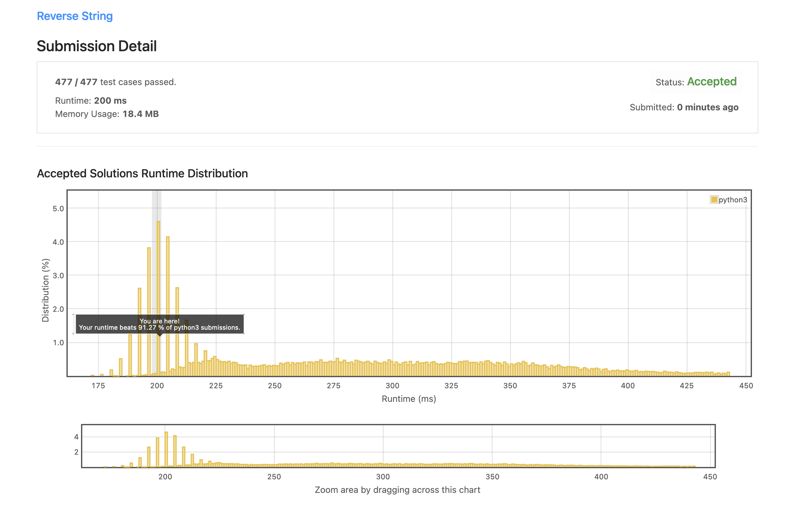
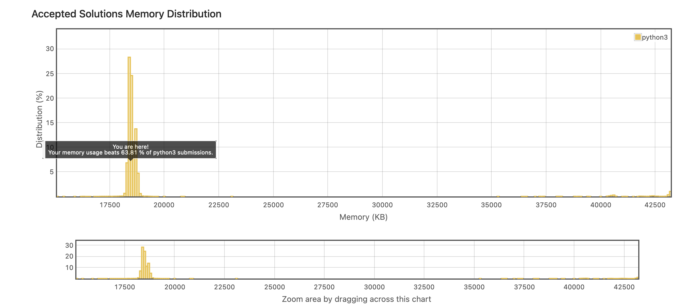

<details>
<summary>Reverse String O(1) SPACE</summary>

#### Instructions

    Write a function that reverses a string. The input string is given as an array of characters s.

    You must do this by modifying the input array in-place with O(1) extra memory.


    Example 1:

    Input: s = ["h","e","l","l","o"]
    Output: ["o","l","l","e","h"]

    Example 2:

    Input: s = ["H","a","n","n","a","h"]
    Output: ["h","a","n","n","a","H"]


    Constraints:

        1 <= s.length <= 105
        s[i] is a printable ascii character.

<details>
<summary>Solution</summary>

```
        j = -1
        i = 0
        while(i < (len(s)//2)):
            temp = s[i]
            s[i] = s[j]
            s[j] = temp
            j -=1
            i +=1

```

</details>

<details>
<summary>Runtime and Space Results</summary>




</details>
</details>
